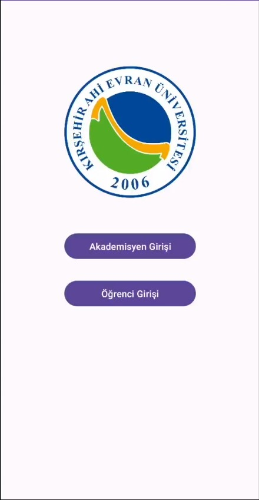

# 📱 QR ile Yoklama

Eğitmenlerin derslerde yoklama işlemlerini dijitalleştirmelerini sağlayan bir mobil uygulama.

## 🚀 Proje Hakkında

"QR ile Yoklama", eğitmenlerin derslerde yoklama işlemlerini daha hızlı ve güvenilir bir şekilde gerçekleştirmelerini amaçlayan bir mobil uygulamadır. Eğitmenler, uygulama üzerinden QR kodları oluşturabilir ve öğrenciler bu kodları tarayarak yoklamaya katılabilirler.

## 🎯 Özellikler

- **QR Kod Oluşturma**: Eğitmenler, ders için özel QR kodları oluşturabilir.
- **QR Kod Tarama**: Öğrenciler, kameralarıyla QR kodları tarayarak yoklamaya katılabilir.
- **Yoklama Kriterleri**:
  - Yoklama günü ve saati kontrolü.
  - QR kodunun oluşturulma süresi (15 dakika içinde geçerli).
  - Öğrencinin konumunun eğitmenin konumuna yakınlığı.
  - Öğrencinin dersi alıp almadığı kontrolü.
  - Tekrarlı QR kod tarama kontrolü.
- **Yoklama Takibi**: Eğitmenler, hafta hafta yoklama verilerini görüntüleyebilir ve gerektiğinde düzenlemeler yapabilir.
- **Öğrenci Paneli**: Öğrenciler, devamsızlık ve katılım durumlarını takip edebilir.

## 🛠 Kullanılan Teknolojiler

- **Android Studio & Java**: Mobil uygulama geliştirme.
- **C# & API**: Veritabanı işlemleri ve sunucu tarafı işlemleri.
- **PostgreSQL**: Veri depolama ve yönetimi.

## 📸 Ekran Görüntüleri

## 🧑‍💻 Katkıda Bulunanlar

- **Muhammet Cerrahoglu** - [LinkedIn](https://www.linkedin.com/in/muhammet-cerrahoglu/)
- **Cihat Erensoy** - [LinkedIn](https://www.linkedin.com/in/cihat-erensoy-852935253/)

